# ARCH=um KVM Control Flow and State Model

Status: 2026-04-27. Bottom-up model of the integrated KVM backend's
runtime state, mutation paths, and one-trap control flow. This is meant
to be used as a debugging map for the remaining intermittent KVM-only
SIGSEGV failures.

## 0. Reading Order

The diagrams are intentionally bottom-up:

1. State ownership: which object owns each piece of mutable state.
2. Memory and shadow state: how PTE changes become KVM-visible.
3. vCPU state: how one physical KVM vCPU is multiplexed across UML tasks.
4. `kvm_enter_guest`: how task/mm state is materialized into KVM.
5. One trap iteration: `kvm_run_userspace` through `KVM_RUN` and dispatch.
6. Fault recovery and signal delivery.
7. Known KVM-vs-seccomp differences and race windows.

## 1. State Ownership

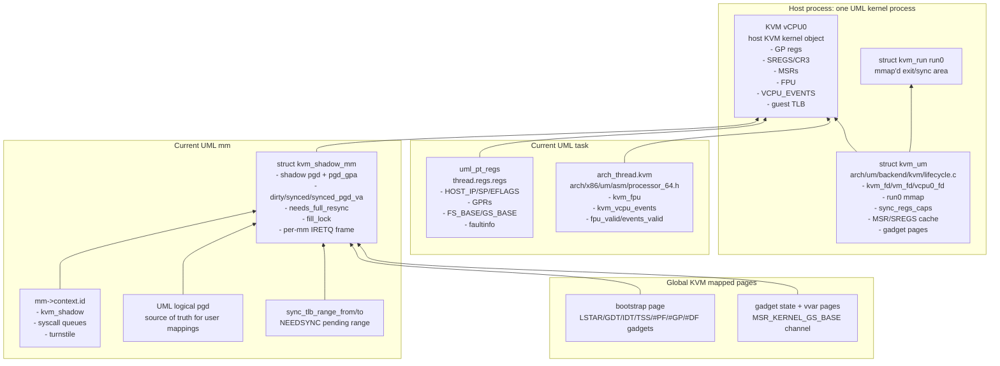

Important ownership rules:

- `struct kvm_um` is global per UML process. It owns one VM and one vCPU.
- `struct kvm_shadow_mm` is per UML mm. It owns the KVM hardware-walkable
  page table and the per-mm IRETQ frame page.
- `arch_thread.kvm` is per task. It snapshots FPU and VCPU_EVENTS because
  the single vCPU is reused by all UML tasks.
- `uml_pt_regs` is the handoff register format used by the common UML
  syscall/fault/signal code.

## 2. Memory and Shadow State

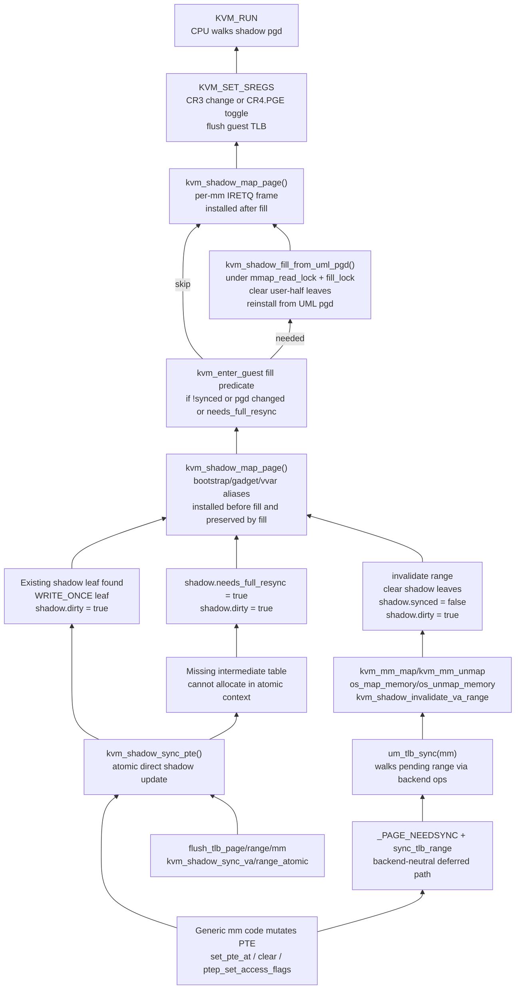

Key invariants:

- UML pgd is the source of truth.
- Shadow pgd is KVM's execution view.
- `dirty=true` means the next entry must force a guest TLB flush.
- `synced=true + synced_pgd_va == mm->pgd + !needs_full_resync` allows
  skipping a full fill.
- Direct sync is allocation-free. If it needs allocation, it only marks
  `needs_full_resync`; repair happens in `kvm_enter_guest`.
- `kvm_mm_map()` still creates host-VA mappings in the parent UML process
  and then invalidates the target mm's shadow.

## 3. vCPU Multiplexing State

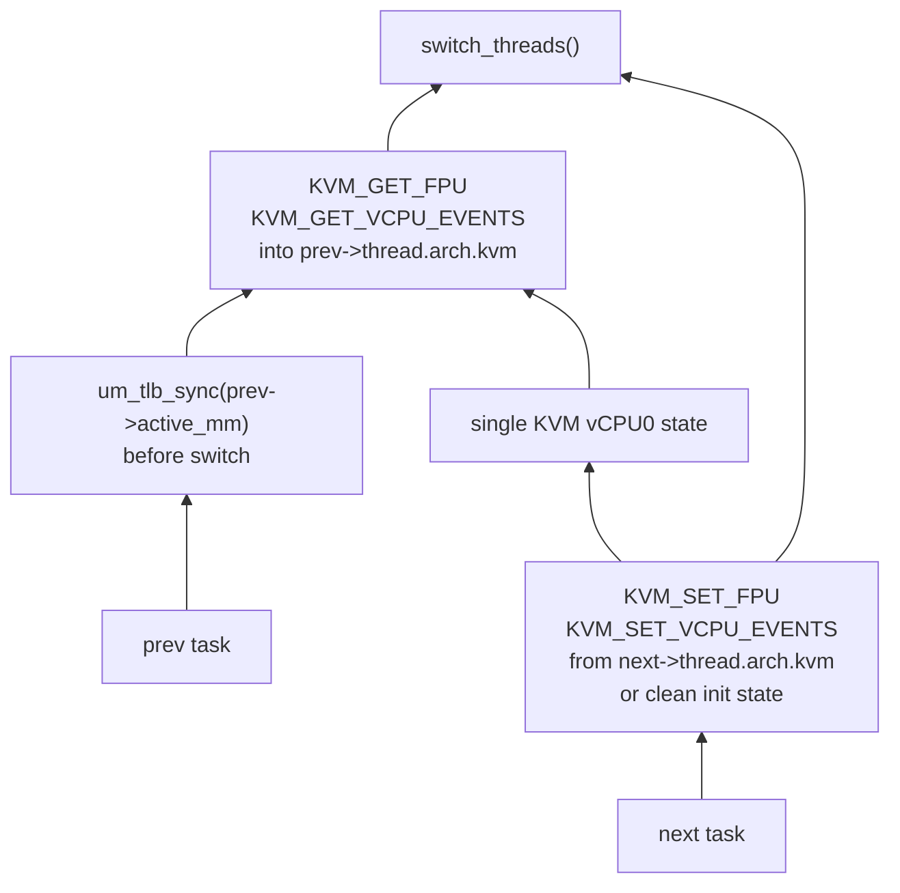

Context-switch invariants:

- Pending PTE work for `prev->active_mm` must be drained before switching.
- FPU and VCPU_EVENTS must be saved/restored because the vCPU persists state
  across `KVM_RUN` calls.
- STAR/LSTAR/FMASK are global vCPU MSRs and are currently primed once.
- `MSR_KERNEL_GS_BASE` is reprogrammed on every entry because `swapgs` and
  arch-prctl paths can otherwise drift the gadget state channel.

## 4. `kvm_enter_guest()` Materialization

```mermaid
flowchart TD
    Start["kvm_enter_guest(regs)"]
    Memslot["ensure memslot and CPUID"]
    Bootstrap["init/map bootstrap page\nLSTAR/GDT/IDT/TSS/#PF/#GP/#DF"]
    Gadget["refresh gadget state + vvar"]
    Shadow["current mm -> kvm_shadow_mm\ncr3_gpa = shadow->pgd_gpa"]
    FillCheck{"shadow synced?\npgd same?\nneeds_full_resync false?"}
    Fill["mmap_read_lock(mm)\nkvm_shadow_fill_from_uml_pgd()\nmmap_read_unlock(mm)"]
    ClearResync["cmpxchg needs_full_resync\nonly clear observed true"]
    FixedMap["map per-mm IRETQ frame\nafter fill"]
    SregsCheck{"SREGS cache hit?\ncr3/fs/gs same\nand !dirty"}
    GetSregs["KVM_GET_SREGS"]
    BuildSregs["set CR3, GDT, IDT, TR\nFS_BASE/GS_BASE"]
    FlushNeeded{"same CR3?"}
    PGEToggle["sentinel KVM_SET_SREGS\nCR4.PGE toggled"]
    SetSregs["KVM_SET_SREGS real state"]
    DirtyClear["cmpxchg shadow.dirty\nonly clear observed true"]
    IretqFrame["write IRETQ frame\n{RIP, CS, RFLAGS, RSP, SS}\ninto per-mm frame page"]
    SetRegs["set GP regs via sync_regs\nor KVM_SET_REGS\nRIP = IRETQ gadget\nRSP = frame guest VA"]
    SyncReq["request synced SREGS on exit\nif KVM_SYNC_X86_SREGS"]
    MSRs["program STAR/LSTAR/FMASK if not primed\nprogram KERNEL_GS_BASE every entry"]
    Done["return to kvm_run_userspace\nready for KVM_RUN"]

    Start --> Memslot --> Bootstrap --> Gadget --> Shadow --> FillCheck
    FillCheck -- no --> Fill --> ClearResync --> FixedMap
    FillCheck -- yes --> FixedMap
    FixedMap --> SregsCheck
    SregsCheck -- hit --> IretqFrame
    SregsCheck -- miss --> GetSregs --> BuildSregs --> FlushNeeded
    FlushNeeded -- yes --> PGEToggle --> SetSregs
    FlushNeeded -- no --> SetSregs
    SetSregs --> DirtyClear --> IretqFrame
    IretqFrame --> SetRegs --> SyncReq --> MSRs --> Done
```

Critical properties:

- The IRETQ frame write is inside a signal-blocked window in the caller.
- Per-mm IRETQ frame storage fixes cross-mm contamination.
- Same-mm task sharing is still a design concern unless the signal-block
  window fully protects frame setup through `KVM_RUN` entry.
- Fixed mappings are installed after full fill so fill cannot clobber the
  per-mm IRETQ leaf.

## 5. One Trap Iteration

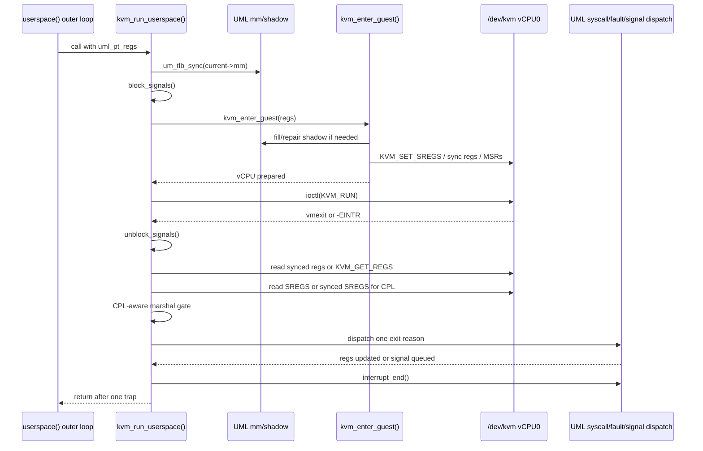

This is deliberately one trap per call. KVM no longer batches a syscall or
fault burst inside an inner loop.

## 6. Exit Reason Dispatch

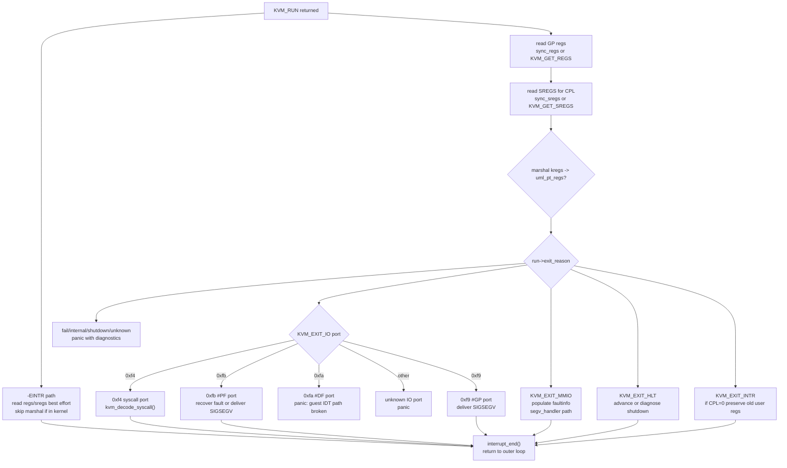

CPL-aware marshal rule:

- CPL=3: marshal KVM regs back to UML regs.
- CPL=0 plus IO/MMIO/HLT: marshal because those handlers need the exit
  state.
- CPL=0 plus `KVM_EXIT_INTR`: do not marshal; preserve the prior user regs
  because the vCPU was interrupted in bootstrap/LSTAR/#PF/#GP ring-0 code.
- `-EINTR`: read SREGS; marshal only if the interrupted guest was in user
  mode.

## 7. Syscall Path

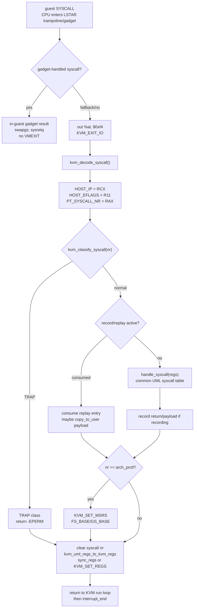

Important syscall state:

- Continuation RIP comes from RCX, not the LSTAR-internal RIP.
- User RFLAGS come from R11, not current kernel-mode RFLAGS.
- `arch_prctl` changes must be pushed to vCPU FS/GS base.
- Post-syscall full shadow refill is intentionally not done; mm-modifying
  syscalls are expected to reach the `mm_map`/`mm_unmap`/TLB paths.

## 8. Page Fault Recovery

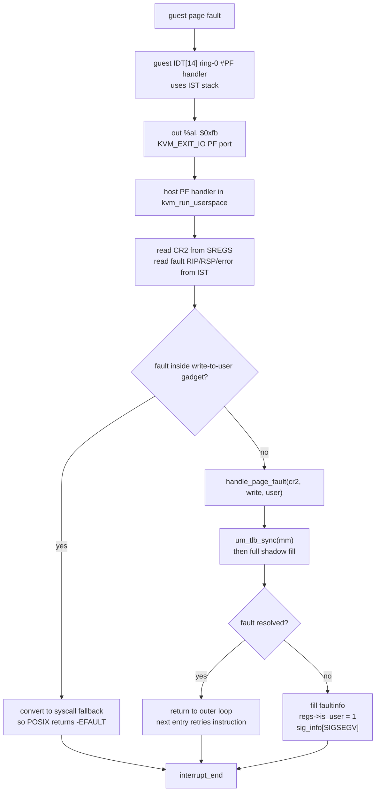

The KVM fault path is hand-rolled. Seccomp/ptrace receive host SIGSEGV from
the stub process; KVM instead uses guest IDT handlers and ports.

## 9. Seccomp/PTRACE vs KVM Shape

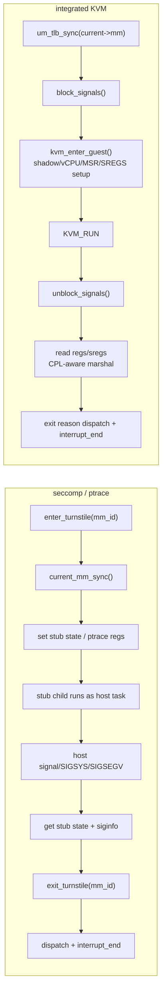

Key differences relevant to KVM-only intermittent SIGSEGV:

- KVM does not use `enter_turnstile()` / `exit_turnstile()`.
- KVM blocks host signals across frame setup and `KVM_RUN` entry.
- KVM relies on a synthetic guest IDT and shadow page tables.
- KVM has a single vCPU with explicit per-task save/restore.
- KVM has a parent-process host-VA mapping model plus a KVM shadow-pgd model.
- Seccomp/ptrace let the host kernel execute the user task as a real host
  task; KVM executes via KVM's vCPU state machine.

## 10. Current Suspect Windows

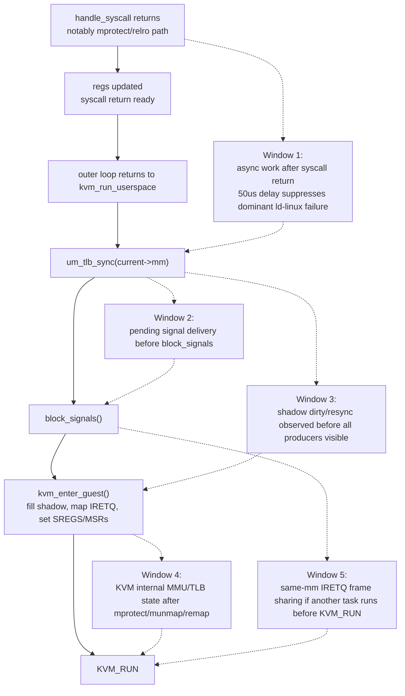

The empirical playbook currently points hardest at Window 1 or Window 4:
a real delay of about 50us suppresses the dominant ld-linux failure, while
barriers and `um_tlb_sync` alone do not.

## 11. Instrumentation Points

Recommended trace points for the next debugging pass:

- Before and after `um_tlb_sync(current->mm)` in `kvm_run_userspace`.
- Immediately before `block_signals()`.
- Immediately after `kvm_enter_guest()` returns.
- Immediately before and after `KVM_RUN`.
- At every `shadow->dirty`, `shadow->synced`, and
  `shadow->needs_full_resync` transition.
- In `kvm_mm_map()` / `kvm_mm_unmap()` with syscall number, VA, length,
  prot, target `mm_id`, and return code.
- In `kvm_shadow_fill_from_uml_pgd()` with counts of cleared/installed
  leaves and whether the fill was due to `needs_full_resync`.
- In #PF fatal path, dump last syscall, last mm mutation, last shadow
  mutation, CR2, fault RIP, and CPL.

The first diagnostic question should be:

> Between a successful `mprotect` return and the next `KVM_RUN`, what
> state changes during the 50us delay that does not change when we only do
> `mb()` or `um_tlb_sync()`?

## 12. Transition Matrix

This table is the quick consistency checklist for tracing. A failing run
should be compared against a passing run at the same phase boundaries.

| Phase | Control point | UML regs | UML mm / pending TLB | KVM shadow | KVM vCPU | Signals |
|-------|---------------|----------|----------------------|------------|----------|---------|
| A | Enter `kvm_run_userspace` | Last user continuation state | May have pending `sync_tlb_range` | May be dirty/stale | Carries prior task/exit state | Unblocked |
| B | After `um_tlb_sync(current->mm)` | Unchanged | Pending range should be drained or panic | Target ranges invalidated; dirty set if changed | Unchanged | Unblocked |
| C | Before `block_signals()` | Unchanged | Same as B | Same as B | Unchanged | Last chance for normal host signal delivery |
| D | Inside `kvm_enter_guest` fill | Unchanged until IRETQ frame write | `mm->pgd` is source of truth | Filled or skip-fill proven valid | SREGS/MSRs/regs being rebuilt | Blocked |
| E | After SREGS/MSRs/regs setup | IRETQ frame reflects `uml_pt_regs` | Same as D | Fixed pages and IRETQ page mapped | vCPU ready to enter bootstrap IRETQ | Blocked |
| F | During `KVM_RUN` | Kernel copy is stale by design | Guest mutates only through exits/faults | CPU walks shadow pgd and guest TLB | Authoritative live guest state | Blocked until exit |
| G | After `KVM_RUN` exit | Must be reconstructed from KVM state | May need sync after fault/syscall | May become dirty/resync due to dispatch | Exit state in `run0` or ioctls | Unblocked |
| H | After dispatch | Syscall/fault/signal code has updated regs | mm mutations should have gone through UML paths | Dirty/resync flags should represent mutations | Post-syscall regs pushed when needed | Unblocked |
| I | After `interrupt_end()` | Ready for outer loop | Scheduler/signals may run | If dirty, next entry must flush | If switched, context switch saves/restores FPU/events | Unblocked |

Fields that should be logged at every A/B/C/D/E/F/G boundary:

- `current`, `current->pid`, `current->mm`, `current->active_mm`.
- `regs->gp[HOST_IP]`, `HOST_SP`, `HOST_AX`, `HOST_CX`, `HOST_R11`,
  `HOST_FS_BASE`, `HOST_GS_BASE`.
- `shadow`, `shadow->pgd_gpa`, `dirty`, `synced`, `synced_pgd_va`,
  `needs_full_resync`, and mutation counters.
- cached SREGS fields: `cached_cr3_gpa`, `cached_fs_base`,
  `cached_gs_base`, `sregs_primed`.
- `run->exit_reason`, CPL, CR2, and whether synced regs were used.
- signal-block depth/state if cheaply available.

## 13. Minimal Debug Hypotheses

Use the model to test these in order:

1. **Latency-dependent visibility after mm mutation.** Something changes
   between phases B and F only when real time passes. Log shadow dirty,
   synced, resync, and KVM exit details around the 50us suppressor.
2. **Host signal timing.** A queued signal delivered before phase C may be
   required for correctness, but KVM blocks it through phase F.
3. **Guest TLB or KVM MMU state.** Phase E says the guest TLB should be
   flushed whenever shadow changed. If a failing run has identical shadow
   state but different behavior, suspect KVM-internal translation state.
4. **Wrong source of truth for a write.** If UML pgd, shadow pgd, and
   guest-observed memory disagree, identify whether the write went through
   `raw_copy_to_user`, host VA mapping, gadget direct store, or guest CPU.
5. **Residual vCPU singleton state.** If failures correlate with task
   switches or same-mm threads, log FPU/events/MSR/SREGS state across
   `kvm_context_switch`.

## 14. Component Inventory

The complete runtime model has these components. If a diagram or trace
does not say which component it is observing, it is probably ambiguous.

| Component | Primary files | Owned state | Main producer | Main consumer |
|-----------|---------------|-------------|---------------|---------------|
| Backend ops contract | `backend.h`, `backend-contract.rst` | op table semantics | boot-time backend selection | all UML backend dispatch sites |
| KVM singleton | `kvm_backend.h`, `lifecycle.c` | VM fd, vCPU fd, `run0`, caches | `kvm_init()` | all KVM runtime paths |
| Per-mm shadow | `mm.c`, `lifecycle.c` | shadow pgd, dirty/synced/resync, IRETQ page | `kvm_mm_attach()` | `kvm_enter_guest()` |
| UML pgd | generic mm + `pgtable.h` | logical PTEs | Linux mm fault/syscall paths | uaccess, TLB sync, shadow fill |
| Deferred TLB sync | `pgtable.h`, `tlb.c` | `sync_tlb_range_from/to`, NEEDSYNC bits | `set_ptes`, `flush_tlb_*` | `um_tlb_sync()` |
| Direct KVM shadow sync | `shadow_sync.c` | shadow leaf writes, counters, resync flag | PTE hooks and flush hooks | next KVM entry |
| Host VA map | `kvm/mm.c`, `tlb.c` | parent-process user VA mappings | `um_tlb_sync()` via `mm_map/mm_unmap` | legacy or still-unidentified paths that require host VAs |
| vCPU architectural state | `thread.c` | GP regs, SREGS, MSRs, FPU, events | `kvm_enter_guest`, context switch, syscall dispatch | KVM CPU execution |
| Bootstrap/gadgets | `thread.c`, `sregs.c` | LSTAR, IDT, GDT, TSS, IST, gadget state/vvar | `kvm_enter_guest_init_bootstrap` | guest ring-0 transitions |
| Fault/signal delivery | `thread.c`, `trap.c`, `signal.c`, `x86/um/signal.c` | faultinfo, pending signals, sigframes | #PF/#GP exits and UML signal code | outer userspace loop and guest handlers |
| Scheduler/interrupts | `thread.c`, `process.c`, `irq.c`, `time.c` | signal mask, pending work, task switch state | host timer/signals, `interrupt_end()` | next trap iteration |
| Record/replay | `record.c`, `thread.c` | replay log and payloads | syscall dispatch hooks | replay-mode syscall return/copyout |

## 15. Lifecycle and Per-mm Allocation

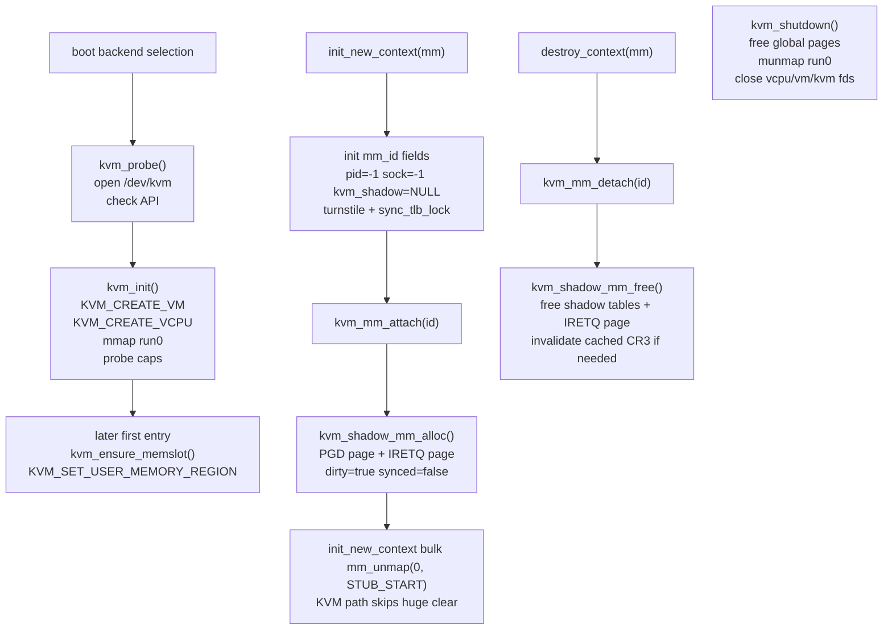

Lifecycle notes:

- The KVM memslot is global and lazy because `uml_physmem` is not ready at
  `kvm_init()` time.
- Each UML mm gets one `kvm_shadow_mm` at `mm_attach`.
- KVM has no stub child; the `init_new_context` bulk unmap is skipped
  because clearing `[0, STUB_START)` would be destructive in the parent
  UML process.

## 16. Three Memory Views

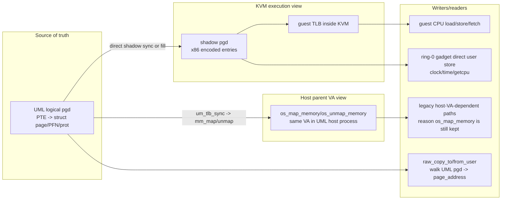

Bug classes by memory view:

- `PGD != SPGD`: shadow sync/fill bug.
- `SPGD correct but GTLB stale`: missing or ineffective KVM TLB flush.
- `PGD/SPGD correct but host VA stale`: parent host-VA aliasing bug.
- `guest CPU sees wrong data but all views look correct later`: wrong
  writer, missing ordering/visibility point, or KVM-internal translation
  timing.

## 17. PTE Producer Paths in Detail

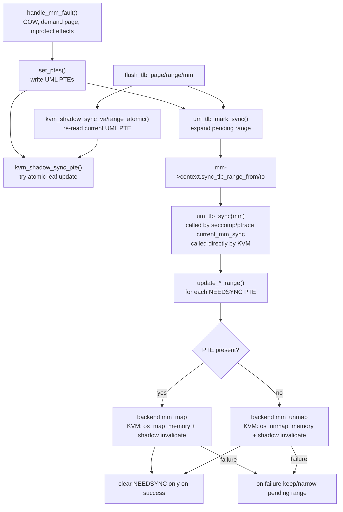

Important accuracy points:

- KVM does not rely on only one sync path. It has both the direct
  `kvm_shadow_sync_pte()` path and the deferred `um_tlb_sync()` backend
  path.
- `current_mm_sync()` discards the return code; KVM calls `um_tlb_sync()`
  directly in `kvm_run_userspace` so a failed sync panics instead of
  continuing with divergent state.
- `flush_tlb_page/range` now re-derives shadow state from the current UML
  PTE rather than blindly clearing the shadow leaf.

## 18. vCPU Register/MSR/SREGS State Machine

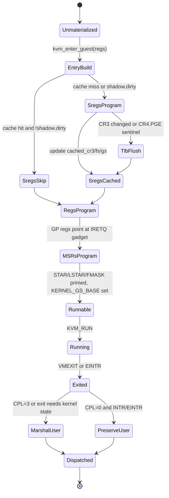

State that must not silently drift:

- `STAR/LSTAR/FMASK`: syscall entry shape.
- `KERNEL_GS_BASE`: gadget state channel; reprogrammed every entry.
- `FS_BASE/GS_BASE`: task TLS; seeded through SREGS and explicitly pushed
  after `arch_prctl`.
- `CR3`: current mm's shadow pgd.
- FPU and VCPU_EVENTS: per-task save/restore on context switch.
- synced register views in `run0`: performance path only; logs should say
  whether sync regs or ioctls were used.

## 19. Signal, IRQ, and Scheduling Timing

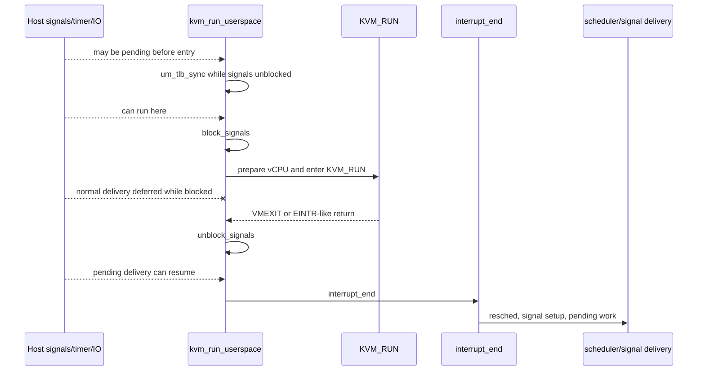

This is the timing surface most relevant to the current failure. If a
50us delay before KVM entry fixes the ld-linux failure, trace whether that
delay permits a host signal, timer event, or other pending work to run
before `block_signals()`.

## 20. Dominant Failure Trace Model

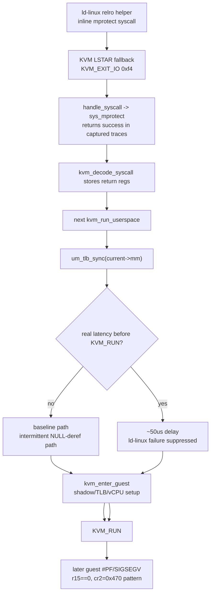

What this model says to test:

- If `mprotect` returns success, the bug is after syscall completion, not
  a direct `mprotect` error return.
- If `mb()` and `um_tlb_sync()` do not help, the missing condition is not
  simply local compiler/CPU memory ordering or the normal deferred sync.
- If real time helps, log every state transition that can occur only when
  signals/timers/KVM-internal work get time to progress.

## 21. Completeness Checklist

A complete failure report should include:

- Last 32 KVM exits: reason, port, CPL, RIP, RSP, CR2, syscall number.
- Last 32 mm events: set/clear PTE, flush, direct sync result, deferred
  `mm_map/mm_unmap`, VA, PFN, prot, return code.
- Shadow state at phase B, E, and G: dirty, synced, resync, pgd_gpa,
  cached CR3, mutation counters.
- Host signal state at phases B/C/E/G: blocked/unblocked, pending SIGALRM,
  pending SIGIO, whether `interrupt_end()` scheduled.
- For fatal #PF: UML PTE, shadow PTE, guest error code, faulting RIP, CR2,
  last writer to the target physical page if known.
- For task switches: prev/next pid, active_mm, FPU/events validity,
  whether `um_tlb_sync(prev->active_mm)` ran.

If these fields are present for one passing run and one failing run of the
same reproducer, the model should make the first divergent state visible.

## 22. Source Cross-check Map

The model above was checked against these source paths:

| Area | Files |
|------|-------|
| Backend contract and op surface | `arch/um/include/shared/backend.h`, `Documentation/virt/uml/backend-contract.rst` |
| KVM ops table | `arch/um/backend/kvm/kvm_backend.c`, `arch/um/backend/kvm/kvm_backend.h` |
| KVM lifecycle and global state | `arch/um/backend/kvm/lifecycle.c` |
| KVM mm attach/map/unmap | `arch/um/backend/kvm/mm.c`, `arch/um/kernel/skas/mmu.c` |
| KVM run loop, entry, exits, gadgets, FPU/events | `arch/um/backend/kvm/thread.c` |
| SREGS construction | `arch/um/backend/kvm/sregs.c` |
| Direct shadow sync | `arch/um/backend/kvm/shadow_sync.c`, `arch/um/include/asm/kvm_mmu_sync.h` |
| PTE and TLB hooks | `arch/um/include/asm/pgtable.h`, `arch/um/include/asm/tlbflush.h`, `arch/um/kernel/tlb.c` |
| Shared fault handling | `arch/um/kernel/trap.c` |
| uaccess data plane | `arch/um/kernel/skas/uaccess.c` |
| Signal delivery and sigreturn | `arch/um/kernel/signal.c`, `arch/x86/um/signal.c` |
| FS/GS syscall state | `arch/x86/um/syscalls_64.c` |
| seccomp/ptrace comparison trap loops | `arch/um/backend/seccomp/trap_user.c`, `arch/um/backend/ptrace/trap_user.c` |
| Current empirical failure data | `Documentation/virt/uml/redesign/02-workstreams/D-kvm-backend/19-next-investigation-playbook/00-playbook.md` |

Files intentionally treated as secondary for the current SIGSEGV model:

- `arch/um/backend/kvm/harness.c`: useful for isolated KVM experiments, but
  not part of normal integrated runtime control flow.
- `arch/um/backend/kvm/snapshot.c`: capture/restore support; relevant if
  reproducer uses KVM snapshots/forkserver.
- `arch/um/backend/kvm/record.c`: record/replay support; relevant if
  `um_kvm_record_enabled` is active.
